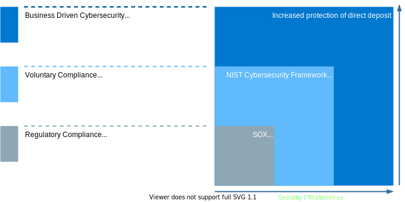
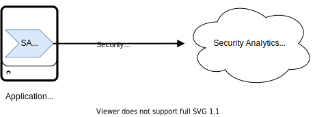
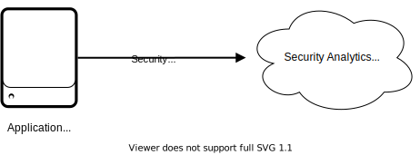
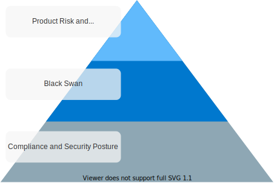

# Cybersecurity Detection Prioritization Standard

---
The Cybersecurity Incident Response Detection Prioritization document captures the rationale and strategy behind the program’s detections. This is done via agent instrumentation and the capture of system, platform, and application logs. This document includes material loss scenarios and compliance standards that prioritize the instrumentation of systems. This document represents the agreed upon and approved standard in which American Airlines’ products are prioritized for detections. The expectation is that information in this document will evolve over time. The Cybersecurity Incident Response team handles updating this document with the adoption of new organizational security standards and policies. Revisions to this document must be clearly communicated in its revision history.

## Product Prioritization

### Compliance and Security Posture

Product driven detection priorities are dictated by the level at which it would increase our maturity and security posture. This should be interpreted as a hierarchy of needs. At a minimum, we must meet mandated compliance and increases in our security effectiveness are “nice to have” detections.

  
*Figure 1: CIRE prioritizes tactically from left to right; mandated compliance to best practices*  

### Black Swans

There are 4 material loss scenarios that motivate our security and resiliency strategies. In the event of any of these, American stands to lose upwards of $100M within a 6-hour time-frame. These damages encompass wide spread negative media coverage, both domestic and international, as well as massive fines. Efforts to detect the early onset of Black Swans along with compliance are CIR’s top priority.

  
*Figure 2: Material loss scenarios (Black Swans)*  

### Risk and DR Criticality

Product risk is an indicator of how long it would take for American to suffer damages when outages or compromise occurs within a given product. Risk associated with disruption to a product varies depending on the core business function it aligns with. The following lists American’s primary business functions and how long it would take for a production outage to significantly impact operations in order of priority:  

- **Flight Operations** - Systems, if unavailable, would impact flight operations the day of customer travel.  

- **Sales** - Systems, if unavailable, within a week would impact the ability of American to generate revenue.  

- **Operational Support** - Systems that, if unavailable, for more than 1 week would impact the maintenance, crew scheduling, or planning support for the fleet.  

- **Corporate Support** - Systems that, if unavailable, for more than 1 month that would impact corporate support functions such as health, pay, or career.

Criticality can be used as a crude temperature gauge to measure the importance of a product to American’s operations. To be clear, its primary function is to communicate the criticality for disaster recovery of the product. Some systems have low criticality while still performing a significant role in other system architectures that are of a higher criticality. Consideration is given to systems that fall under this category, but in general vital and critical systems trump important and discretionary.

  
*Figure 3: Product priority based on risk to business from right to left; prioritization based on DR criticality from top to bottom*  

## Instrumentation Strategy

### Endpoint Detection and Response

EDR as a detection method is reserved for Linux and Windows operating systems. The EDR service is a form of instrumentation on the host system. Deployed as an agent, EDR monitors running processes/binaries as well as network activity on the host and forwards the information to a centralized aggregation site. There, the events are analyzed for suspicious activity and actionable alerts are generated for the purpose of response. EDR Agents can be deployed on servers, desktops, and within containers. This is our easiest detection strategy to deploy and as such is prioritized over logging strategies.

  
*Figure 4: Instrumentation using Endpoint agents*  

### Security Analytics Platform

The SA platform serves as the CIR security data lake. Security logs, threat intel, asset information, and other data are aggregated in this platform so that analytics strategies can be leveraged to detect suspicious/anomalous behavior in our network. There are two main methods for collecting systems’ logs for this service.  

#### Agent Based Log Collection

Like Endpoint agent, SA agents are deployed to the host system to collect logs and forward them to the SA platform. The SA agent can be used to filter and transform logs, thus making it versatile when handling logs in various formats as well as forwarding only security relevant logs to the SA platform. However, this is a more involved deployment process over the Endpoint agent and thus takes more planning from CIR. Agents are supported on Windows and Linux operating systems. Deployments are performed on servers, kiosks, and Kubernetes clusters using a sidecar pattern.

  
*Figure 5: Log capture using SA agents*  

#### Remote Logging

There are scenarios in which the installation of a logging agent isn’t possible. Given these constraints, systems and applications can be configured to log remotely to the SA platform. This process is the most demanding as it typically involves a logging change on the host operating system, platform, container, or application. These tend to be more strategic efforts that require coordination with the owner of the subject system and CIR to ensure the correct logs are being forwarded to the SA platform in an acceptable format.

  
*Figure 6: Logging directly to SA via remote logging*

## Prioritization by Detection Method

### Ordering Product Prioritization

Using the information detailing Product Prioritization, CIR tactically targets systems for instrumentation. To hit the bare minimum, CIR prioritizes compliance and security posture first when deploying detections. Priority follows up the chain as depicted in Figure 7.

  
*Figure 7: Our prioritization strategy is built upon each category with those at the bottom being fundamental to those at the top*  

### System Logging Levels

Within each category, CIR further prioritizes detection based on how quickly detections can be put in place. The tactical speed of instrumenting systems is described in the earlier sections of this process document. Apart from EDR, logging is prioritized by the following categories:  

- **Operating System** - Large scale impact as the variance in configuration to set up the logging is minimal and well defined as a time-boxed repeatable process  

- **Platform/Device** - Less uniform in configuration than OS, but still a manageable amount of variance to execute instrumentation quickly with a large detection impact (web server, DB, Firewall, Router, etc.)  

- **Container** - Little variance in configuration, little impact given AA presence in the cloud  

- **Application** - High variance in logging configuration, format, and content. These are strictly strategic efforts that require thorough planning form application owners and CIR.
