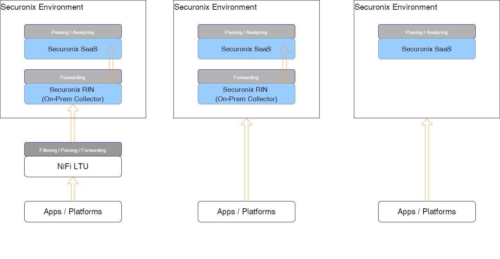
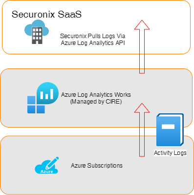
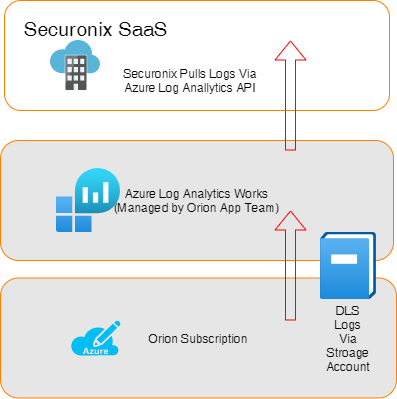

# Patterns

This page explains high level common patterns for logs collection.  

> 📝 Note:
    There might be special circumstances where none of the below patterns are applicable or practical. In those scenarios, CIRE engineer will review best way to collect logs with application SMEs.

## Conceptual

### Through NiFi LTU - Most Common Pattern

Using this self-service pattern, origin systems or applications send logs to the Log Transport Utility (LTU, powered by [NiFi](https://nifi.apache.org/)) in each data-center. Application teams can consult the CIRE team on filtering non-security logs from their data pipeline and transforming data to acceptable formats using various pattern matching techniques in LTU.  

After we have relevant logs in LTU, CIRE team forwards those logs to Securonix On-Prem events collectors - commonly within the same data-center.

### Directly to Securonix Collector - Least Common Pattern

In few situations where applications cannot send logs to LTU because of high events per second (EPS), CIRE recommends this service provider managed pattern.  

This is to be leverage by exception. By doing this, we are losing flexibility of maintaining parsing, filtering, and takes control away from application teams to manage their own data.  

### Cloud to Cloud integrations - Most Common for Cloud Apps

This pattern is recommended for cloud services logs, such as Azure Kubernetes, Key Vault audit logs, or cloud platform audit logs.  

This type of integration can be done via various methods depending upon where the application is hosted and what are the capabilities supported by the hosting provider or application vendor.

#### Examples

1. From Azure services, such as Azure Functions, App Services, Key Vault, etc.

    These logs can be forwarded to CIRE managed Log Analytics Workspace in Azure. We are then querying these records via API call from Security Analytics Platform.

    Here's the log analytics workspace configuration:

    > Subscription: aa-cstrm-prod-spoke  
    > Resource Group: cstrm-p-eaus-cir-securityanalytics-rg  
    > Azure Log Analytics Workspace: cstrm-p-eaus-cir-securityanalytics-la  

    Example showing pattern for Azure activity logs
    

2. When we cannot use CIRE workspace

    In some situations, you may already have your own workspace and want us to use that instead of sending logs to above workspace. In this case, we should have further discussion to make sure we can understand requirements.  

    If we select this option, application team will need to provide **DATA.READ** access to below service principle. We use this service principle to configure API client/secret so that Security Analytics Platform can pull in those logs.

    > Security Analytics Service Principle: aa-cstrm-p-zeaus-securityanalytics-sp  

    Example showing pattern for Orion Data Lake logs using application workspace  

    
