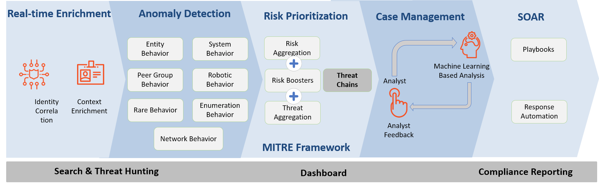

# Overview

This section explains overall functionality of "Security Analytics Platform" and importance of security events collection  

CIR team collects and analyzes security events and alerts from various applications and systems to detect unauthorized usage or mis-use of AA applications, systems or accounts.  

Logging mechanisms and the ability to track user or system activities are critical in detecting, preventing or minimizing the impact of a data or system compromise. The generation of security audit logs in various environments allow for systematic tracking, alerting, and analysis of security incidents.  

"Security Analytics Platform" normalizes, and correlates such events from multiple applications and systems. Correlated events are then used to detect complex behavior; such as, attempts to *access accounts in an unauthorized manner* or *multiple login failures followed by successful authentication* for business critical accounts.  

Various detection policies in analytics platform are used to identify security incidents and alert CIR analysts, who determine what actions need to be taken to verify whether the system has been compromised and then what actions should be taken to respond to the incident proportionally.

## Securonix

[Securonix](https://www.securonix.com/) is our next-gen security analytics platform. This is a SaaS service that provides following functionalities at a high level:

1. Security Information and Events Management

    Built on big data, Securonix Next-Generation SIEM combines log management, UEBA, and security incident response into one, end-to-end security operations platform.

    It collects massive volumes of data in real-time, uses machine learning algorithms to detect advanced threats, and provides artificial intelligence-based security incident response capabilities for fast remediation

2. User and Entity Behavior Analytics

    UEBA leverages machine learning and behavior analytics to analyze and correlate interactions between users, systems, applications, IP addresses, and data.

    Securonix UEBA detects advanced insider threats, cyber threats, fraud, cloud data compromise, and non-compliance. It also provides capability to leverage built-in automated response playbooks and customizable case management work flows to assist with responding to threats quickly, accurately, and efficiently.

### Securonix UEBA Functionality Overview

Following is a conceptual diagram that shows various capabilities into Securonix platform for Anomaly Detection  

Testing
testasdf

--8<-- "includes/abbreviations.md"
