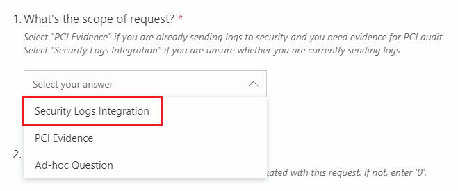
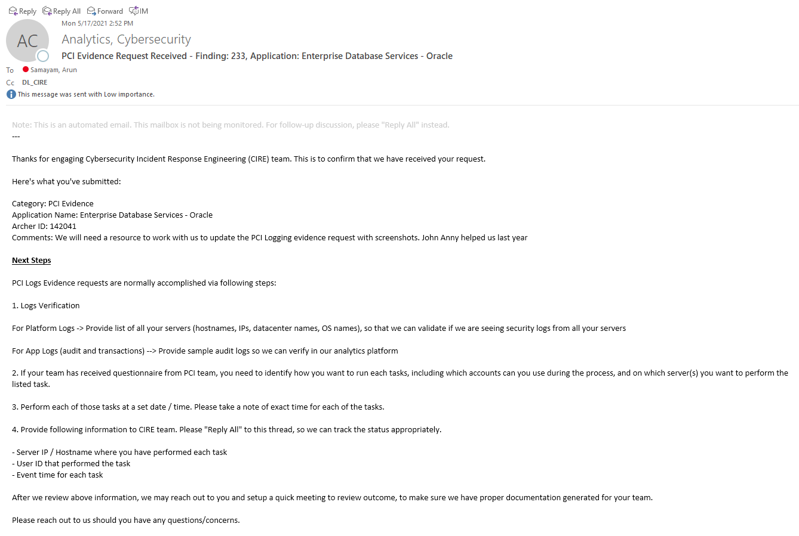

# Processes and Procedures

This document outlines various processes related to logs integration, including how to engage CIRE team  

Overall logs ingestion into Security Analytics Platform is broken down in two high level processes:  

1. [Engagement Process](#engagement-process) - Application team submits initial request to CIRE team
2. [Logs Integration Process](#logs-integration-process) - During this phase, CIRE team works with app SMEs and other stake holders to understand requirements around parsing and policies creation.  

## Engagement Process

Here's the steps to make sure we can successfully onboard security logs to our analytics platform. As we are continuously improving our processes, this particular process might change in future to make it easier to interact with CIRE team directly via CI/CD pipeline.  

>📝 Note: All incoming requests are prioritized based on a set criteria outlined in [this prioritization document](../References/detection-prioritization.md). If you have an app that you need to onboard quicker due to any other pressing needs, please reach out to us and we can certainly review your use-case and see if it requires different priority.  

- Step 1. Application SMEs or product owners need to submit engagement request via this engagement form --> [Click here to open MS form](https://forms.office.com/r/SruV5aZRFZ).  

Please make sure to select the correct option in dropdown. All log integration requests should use below option.  

>⚠ Warning: "PCI Evidence" option is only used when you already know that logs are in Security Analytics Platform and you need evidence to meet PCI compliance needs.  

- Step 2. After successful submission, you should see an email confirmation similar to this. This email explains next steps, such as engaging SAE team for onboarding logs to LTU if the pattern requires logs to be in LTU before sending to Security Analytics Platform.  

>📝 Note: For known integration patterns, please review [this](./log-integration-patterns.md) document

- Step 3. After CIRE team prioritize this request, an assigned engineer will reach out to the submitter or application SMEs to start initial conversations about potential security use-case for the logs and also review possible filtering / parsing of logs in either LTU or at application side.  

## Logs Integration Process

This page explains overall process to integrate security logs to analytics platform.  

Overall logs integration process is broken down into three major phases. Below is high level description of each of the phases, including goal and expectations.  

### Various Phases  

- Phase 1: Logs Collection  
      - This phase includes logs collection from application / platforms to analytics environment.  
      - **Identify** security logs from source systems - this task is normally performed by application SME. CIRE team can help to review various types of security events, however it is expected that application SME knows how to identify relevant events.  
      - **Finalize** logs collection pattern - this task normally requires discussion with all stakeholders (application SME, CIRE and SAE).  Various patterns are documented in [Logs Collection Patterns](log-integration-patterns.md) page for additional reference.  
      - **Send** security logs to NiFi LTU (if pattern requires this) or directly to Security Analytics Platform. This task can be performed by any stakeholders (application SME, CIRE engineer or SAE engineer) depending upon integration pattern
      - **Filter** irrelevant logs, such as health checks or application telemetry information in LTU or at application level before sending logs to Security Analytics Platform. This task can be performed by any stakeholders depending on where the filter logic can be implemented. However, detailed discussion with application SMEs is required so that CIRE engineer can understand log flow.  
- Phase 2: Logs Configuration  
      - This phase mainly includes log source configuration within analytics platform.  
      - This configuration is primarily managed by CIRE engineer. However, in some situations, CIRE engineer may reach out to application SME to review logs content, to make sure logs are correctly parsed in analytics platform  
      - CIRE engineer performs various tasks, such as **creates** new log source, **parses** logs (if needed), **maps** various fields to standard vendor attributes, and **schedules** log source in the Security Analytics Platform
- Phase 3: Policies and Alerts Configuration  
      - This phase includes policies and threat model configuration in analytics platform so that we can detect malicious behavior and generate alerts so that security analysts can review those and perform appropriate remediation tasks.  
      - This configuration is performed by CIRE engineer.  
      - CIRE engineer normally **creates** new policies and threat models, or **updates** existing configuration to make sure this new log source can generate relevant alerts.

>📝 Note: Review this document to understand how CIRE team prioritizes new integration requests --> [Detection Prioritization](../References/detection-prioritization.md).  
